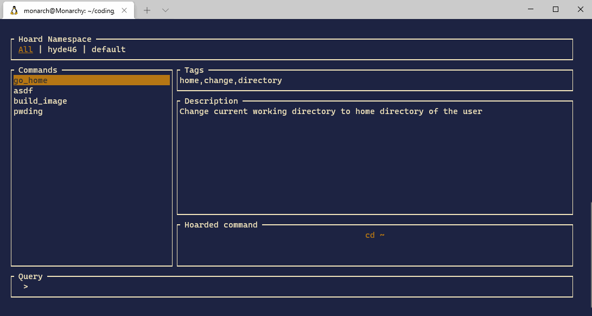

# hoard

> A command organizer utility written in rust



#### What is a command organizer?

A command organizer lets you save commands that you often use, but are too complicated to remember.
For every **hoarded** command, `hoard` saves

- name
- tags
- description
- namespace where it lives in
- the command itself

If you get lost in your massive command history, and can't find for example a specific `docker` command out of thousand `docker` commands you've already ran,
just **hoard** it. With a **name** and **description** it will be much easier to find again. When you look for that command again a month later, take a look at your **hoarded** commands.

`hoard` is **not** supposed to replace shell history finder like `fzf` `atuin` or similar utilities. It rather should be used in conjunction with them.

## Install

### From source

It's best to use [rustup](https://rustup.rs/) to get setup with a Rust
toolchain, then you can run:

```
cargo build --release
```

Find the binaries in `./target/release/hoard`
Move it to wherever you need it ( Like `/usr/local/bin/hoard` )

### Linux

Install `hoard` by running

```
LATEST_RELEASE=0.1.3 ./install.sh
```

Only Ubuntu based distributions with a bash or zsh shell are supported at the moment

### MacOS

No codesign in place yet. You have to build it from source

### Homebrew

```
brew tap Hypde46/hoard
brew install hoard
```

### Install Shell plugin

Install `hoard` as a plugin to enable autocomplete.
Depending on your shell, run one of the following commands.
To keep it installed for your next shell session, add the `source` command with an absolute path to your `.bashrc` or copy-paste the plugins content to your `.bashrc`.

#### bash

```
source src/shell/hoard.bash
```

#### zsh

```
source src/shell/hoard.zsh
```

## Usage

#### Save a new command

```
hoard new
```

#### Delete a command

```
hoard delete <name>
```

#### Search through command trove

```
<Ctrl-h>
```

Or alternatively, if not installed as a plugin, the interactive search can still be performed, though without autocomplete. This assumes the user to copy the command by mouse from the UI

```
hoard list
```

Next item in command list

```
<Ctrl-N> / <Down-Arrow>
```

Previous item in command list

```
<Ctrl-P> / <Ctrl-Y> / <Up-Arrow>
```

Next namespace tab

```
<Ctrl-L> / <Right-Arrow>
```

Previous namespace tab

```
<Ctrl-H> / <Left-Arrow>
```

Select command

```
<Enter>
```

Quit

```
<Esc> / <Ctrl-D> / <Ctrl-C> / <Ctrl-G>
```
